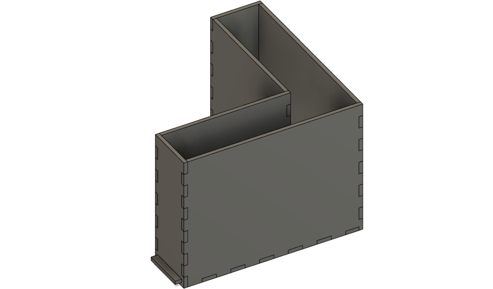

# L-maze for mice

L-maze for mouse with removable floor.

Walls are 20cm height, hallway is 6.5cm wide, arms are 26.5 cm long.

## Components
- [6mm opaque white acrylic sheets](https://www.polymershapes.com/product/acrylic/)
- [4mm corrugated plastic sheets](https://www.polymershapes.com/product/polypropylene-twinwall-corrugated-plastic/)

## Build instructions
- Laser cut the acrylic sheets using the [provided CAD drawings](CAD). Remove protective film.
- Finish cutting the corrugated plastic with the help of a utility knife, if needed.
- Assemble all acrylic parts (except for the roof) using painter's tape and apply acrylic cement or 2-part epoxy. Remove painter's tape after drying.

## Usage
- Insert the removable floor made of corrugated plastic.
- Place the mouse in the maze.

## Version History
### 0.1.0
* 2023-05-08
  - Initial Release.

## License
© 2023 [Leonardo Molina][Leonardo Molina]

This project is licensed under the [Creative Commons BY-NC-SA 4.0 License](https://creativecommons.org/licenses/by-nc-sa/4.0/).

[Leonardo Molina]: https://github.com/leomol
[LICENSE.md]: LICENSE.md